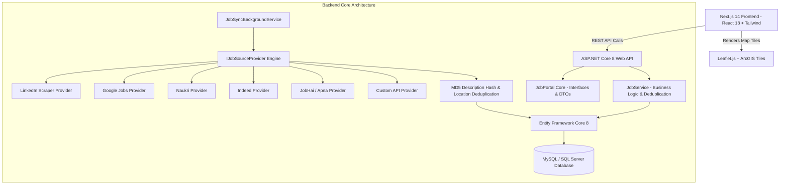

# 🗺️ LycheeJob.com - Map-Based Job Search & Aggregator Portal

A production-grade, high-performance **Map-Based Job Aggregator Platform** built with **ASP.NET Core 8 Web API** and **Next.js 14 (App Router)**. Features high-density split-screen UI, interactive **ArcGIS World Street Mapping**, multi-source background scrapers (LinkedIn, Google Jobs, Naukri, Indeed, Foundit, JobHai, Glassdoor, etc.), MD5 de-duplication pipeline, and real company brand logos.

---

## 🏗️ 1. Project Architecture

The application is architected using a decoupled **Client-Server & Modular Provider** pattern:



### 📁 Directory Structure Overview

```text
Map job Project/
├── backend/
│   ├── JobPortal.Api/                 # ASP.NET Core 8 Controllers & Swagger Config
│   │   ├── Controllers/               # Jobs, Admin, Sources, Locations Controllers
│   │   ├── Program.cs                 # API Startup & Service DI Registrations
│   │   └── appsettings.json           # Database Connection String & Config
│   ├── JobPortal.Core/                # Domain Entities, DTOs & Interfaces
│   │   ├── Entities/                  # Job, Company, JobSource, Skill, SavedJob
│   │   ├── DTOs/                      # Request/Response Data Transfer Objects
│   │   └── Interfaces/                # IJobService, IJobSourceProvider, IGeocodingService
│   ├── JobPortal.Infrastructure/        # EF Core DbContext, Background Services & Scrapers
│   │   ├── Data/                      # AppDbContext & Fluent API Mappings
│   │   ├── JobSources/                # 12+ Pluggable Aggregator Providers
│   │   └── Services/                  # Deduplication Engine & Job Search Queries
│   └── JobPortal.Tests/               # XUnit Tests for Geocoding & Deduplication
│
└── frontend/                          # Next.js 14 App Router
    ├── src/
    │   ├── app/                       # Next.js Pages (Main Map, Admin, Saved, Job Details)
    │   ├── components/                # JobMap, JobCard, Header, FilterPanel, JobInfoWindow
    │   ├── services/                  # Axios REST API Client with Resilient Fallback
    │   └── types/                     # TypeScript Interfaces & Enums
    └── tailwind.config.js             # Custom Design System Tokens
```

---

## ⚡ 2. Technical Stack

| Layer | Technology | Key Features |
| :--- | :--- | :--- |
| **Frontend Framework** | **Next.js 14 (App Router)** | Dynamic SSR/CSR, React 18, TypeScript |
| **Mapping Engine** | **Leaflet.js + ArcGIS** | World Street Map Tiles, Zero API Key Lock-in |
| **Styling & UI** | **Tailwind CSS + Lucide Icons** | Glassmorphism, Dark Slate Theme, Custom Animations |
| **Backend Framework** | **ASP.NET Core 8 REST API** | Clean Architecture, Swagger OpenAPI, Async Pipelines |
| **Database ORM** | **Entity Framework Core 8** | Code-First Migrations, Dynamic Spatial Querying |
| **Database Engine** | **MySQL 8.0 / SQL Server** | Indexed Geo-coordinates, MD5 Description Hashing |
| **Background Sync** | **HostedService (BackgroundWorker)** | 30-min Automated Multi-Source Job Scraping & Upsert |

---

## 📡 3. REST API Endpoint Reference

All endpoints return JSON responses in a standardized envelope format:

```json
{
  "success": true,
  "data": [ ... ],
  "pagination": { "currentPage": 1, "pageSize": 25, "totalItems": 120, "totalPages": 5 }
}
```

### 🔹 Job Search & Spatial Map Endpoints

#### 1. Search & Filter Jobs (Map Bounding Box Supported)
* **`GET /api/jobs`**
* **Query Parameters:**
  * `keyword` (string): Search term in title, company, skills, or description.
  * `city` (string): Filter by city (e.g. `Delhi`, `Noida`, `Gurgaon`, `Bangalore`, etc.).
  * `north`, `south`, `east`, `west` (double): Bounding box coordinates for visible map area.
  * `userLat`, `userLng`, `radiusKm` (double): Proximity search around user location.
  * `minSalary`, `maxSalary` (decimal): Annual salary range filter in INR.
  * `jobTypes` (string[]): `FullTime`, `PartTime`, `Contract`, `Internship`.
  * `workModes` (string[]): `OnSite`, `Hybrid`, `Remote`.
  * `sources` (string[]): Filter by source (e.g., `LinkedIn`, `Google Jobs`, `Naukri`).
  * `hasInterviewDate` (boolean): Show only walk-in interview jobs.
  * `page` (int, default: 1): Page number.
  * `pageSize` (int, default: 25): Items per page.
  * `sortBy` (string): `relevance`, `newest`, `oldest`, `salary_high`, `salary_low`, `distance`.

#### 2. Get Job Details by ID
* **`GET /api/jobs/{id}`**
* **Path Parameter:** `id` (int) - Job ID.
* **Returns:** Complete job details including company profile, full description, recruiter contact details, and walk-in venue.

#### 3. Toggle Bookmark / Save Job
* **`POST /api/jobs/{id}/save`**
* **Body:** `{ "isSaved": true }`

---

### 🔹 Admin & Aggregator Sync Endpoints

#### 4. Trigger Manual Background Source Synchronization
* **`POST /api/admin/sync`**
* **Description:** Manually triggers background scrapers across all 12 job source providers, deduplicates data using MD5 hashing, and upserts new listings into MySQL.
* **Returns:**
  ```json
  {
    "success": true,
    "message": "Background sync completed successfully.",
    "processedSources": 12,
    "insertedJobs": 84,
    "updatedJobs": 16
  }
  ```

#### 5. Get Aggregator Health & Sync Statistics
* **`GET /api/admin/stats`**
* **Returns:** Total jobs count, active source count, duplicate counts, and last sync timestamp for each provider.

---

### 🔹 Metadata & Location Endpoints

#### 6. Get Active Job Sources List
* **`GET /api/sources`**
* **Returns:** List of supported platforms (`LinkedIn`, `Google Jobs`, `Naukri`, `Indeed`, `Foundit`, `Glassdoor`, `JobHai`, `Apna`, `Internshala`, `Government Jobs`).

#### 7. Get Popular Cities & Spatial Centroids
* **`GET /api/locations`**
* **Returns:** Array of top 22 Indian tech hub cities with default latitude/longitude coordinates.

---

## 🗄️ 4. Database Schema & Tables

The `JobPortalDb` database comprises 7 relational Entity Framework Core tables:

1. **`Jobs`**: Core listing table containing spatial coordinates (`Latitude`, `Longitude`), walk-in interview details, contact info, and `DescriptionHash`.
2. **`Companies`**: Company profiles, industries, and clearbit logo resolvers.
3. **`JobSources`**: Master table tracking aggregator providers and sync schedules.
4. **`Skills`**: Normalized skill names (e.g. `React`, `TypeScript`, `C#`, `.NET Core`).
5. **`JobSkills`**: Many-to-many junction table mapping jobs to skills.
6. **`SyncLogs`**: Audit trail of background scraper sync execution history.
7. **`SavedJobs`**: User saved/bookmarked job IDs.

---

## 🚀 5. Local Setup & Execution Guide

### Prerequisites
* **.NET 8 SDK** installed (`dotnet --version`)
* **Node.js 18+** & **npm** (`node -v`)
* **MySQL 8.0** (or local SQLite auto-fallback)

### 1. Run ASP.NET Core Backend API
```bash
# Navigate to backend API folder
cd "backend/JobPortal.Api"

# Configure connection string in appsettings.json (Default password: m00se_1234)
# "Server=localhost;Database=JobPortalDb;User=root;Password=m00se_1234;"

# Restore & Run API Server
dotnet restore
dotnet run
```
Backend API will be live at: **`http://localhost:5000`**  
Swagger OpenAPI Documentation: **`http://localhost:5000/swagger`**

### 2. Run Next.js 14 Frontend
```bash
# Navigate to frontend folder
cd "frontend"

# Install dependencies
npm install

# Start Next.js Development Server
npm run dev
```
Frontend Web Portal will be live at: **`http://localhost:3000`**

---

## 📄 License
This project is open-source under the MIT License. Developed for **LycheeJob.com**.
